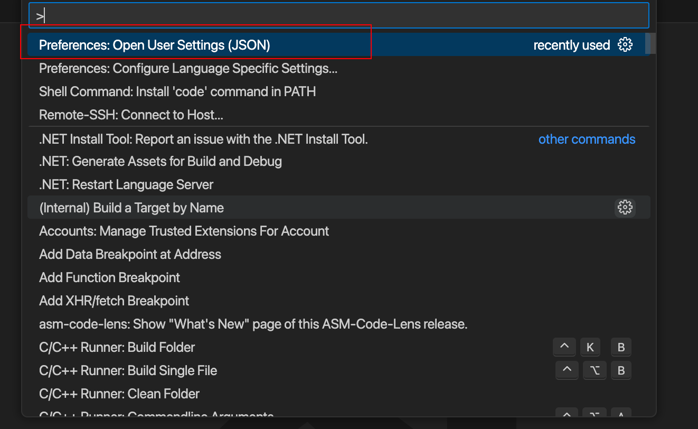

# 常用的编辑器设置

输入`command + shift + p`：

 

选择红色的。之后修改`settings.json`文件：

```json
{
    "git.autofetch": true,
    "cmake.configureOnOpen": true,
    "remote.SSH.useLocalServer": false,
    //控制编辑器自动格式化粘贴的内容
    "editor.formatOnPaste": true,
    //在保存文件后进行代码格式化
    "edit006Fr.formatOnSave": true,
    //编辑区域
    "editor.fontSize": 18,
    //集成终端
    "terminal.integrated.fontSize": 14,
    //输出窗口
    "[Log]": {
        "editor.fontSize": 15
    },
    //调整窗口的缩放级别
    "window.zoomLevel": 0,
    //设置连体字
    "editor.fontFamily": "Fira Code",
    "editor.fontLigatures": true,
    //设置自动保存的模式
    "files.autoSave": "afterDelay",
    "files.autoSaveDelay": 1000,
    //设置一个制表符(Tab)等于的空格数
    "editor.tabSize": 4,
    //设置按Tab键时插入空格还是制表符(Tab)
    "editor.insertSpaces": true,
    //控制编辑器在空白字符上显示符号的方式
    "editor.renderWhitespace": "selection"
}
```

