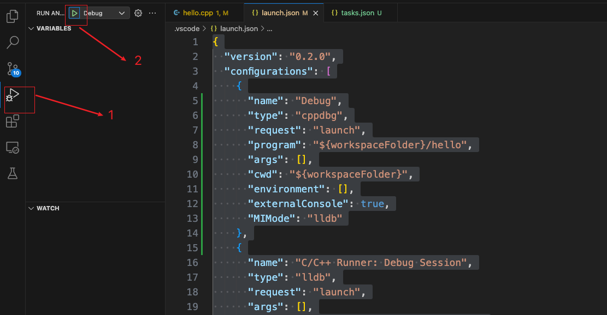

# 编译CPlusPlus代码

## 1. 重要文件

### 1.1 tasks.json

执行`command + shift + b`：根据`tasks.json`编译代码。

```json
{
	"version": "2.0.0",
	"tasks": [
		{
			"label": "build main",
			"type": "shell",
			"command": "clang++",
			"args": [
				"hello.cpp",
				"-o",
				"hello",
				"-g"
			],
			"group": {
				"kind": "build",
				"isDefault": true
			}
		}
	]
}
```

### 1.2 launch.json

调试代码：

```json
{
  "version": "0.2.0",
  "configurations": [
    {
      "name": "Debug",
      "type": "cppdbg",
      "request": "launch",
      "program": "${workspaceFolder}/hello",
      "args": [],
      "cwd": "${workspaceFolder}",
      "environment": [],
      "externalConsole": true,
      "MIMode": "lldb"
    },
    {
      "name": "C/C++ Runner: Debug Session",
      "type": "lldb",
      "request": "launch",
      "args": [],
      "cwd": "/Users/niu0217/niuGithub/MyGit",
      "program": "/Users/niu0217/niuGithub/MyGit/build/Debug/outDebug"
    }
  ]
}
```

## 2. 具体步骤

### 2.1 创建tasks.json

执行命令`command + shift + p`，然后选择下面红色部分：

 

然后随便选一个，就可以创建出 tasks.json文件。

### 2.2 修改tasks.json文件

```json
{
	"version": "2.0.0",
	"tasks": [
		{
			"label": "build main",
			"type": "shell",
			"command": "clang++",
			"args": [
				"hello.cpp",
				"-o",
				"hello",
				"-g"
			],
			"group": {
				"kind": "build",
				"isDefault": true
			}
		}
	]
}
```

修改成这个样子。我们的目的是将hello.cpp文件编译为hello。

执行`command + shift + b`：根据`tasks.json`编译代码。我们会看到当前目录下会有一个hello的可执行文件。

 

### 2.3 修改launch.json文件

```json
{
  "version": "0.2.0",
  "configurations": [
    {
      "name": "Debug",
      "type": "cppdbg",
      "request": "launch",
      "program": "${workspaceFolder}/hello",
      "args": [],
      "cwd": "${workspaceFolder}",
      "environment": [],
      "externalConsole": true,
      "MIMode": "lldb"
    },
    {
      "name": "C/C++ Runner: Debug Session",
      "type": "lldb",
      "request": "launch",
      "args": [],
      "cwd": "/Users/niu0217/niuGithub/MyGit",
      "program": "/Users/niu0217/niuGithub/MyGit/build/Debug/outDebug"
    }
  ]
}
```

按照下面的方式点，就可以调试代码了：

 

