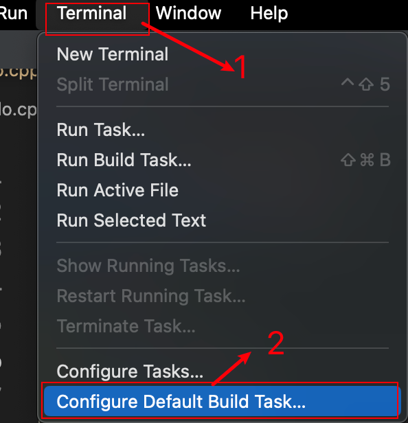
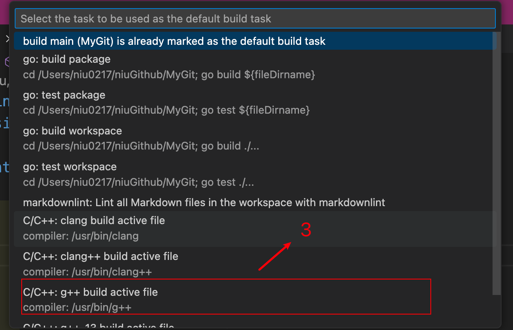
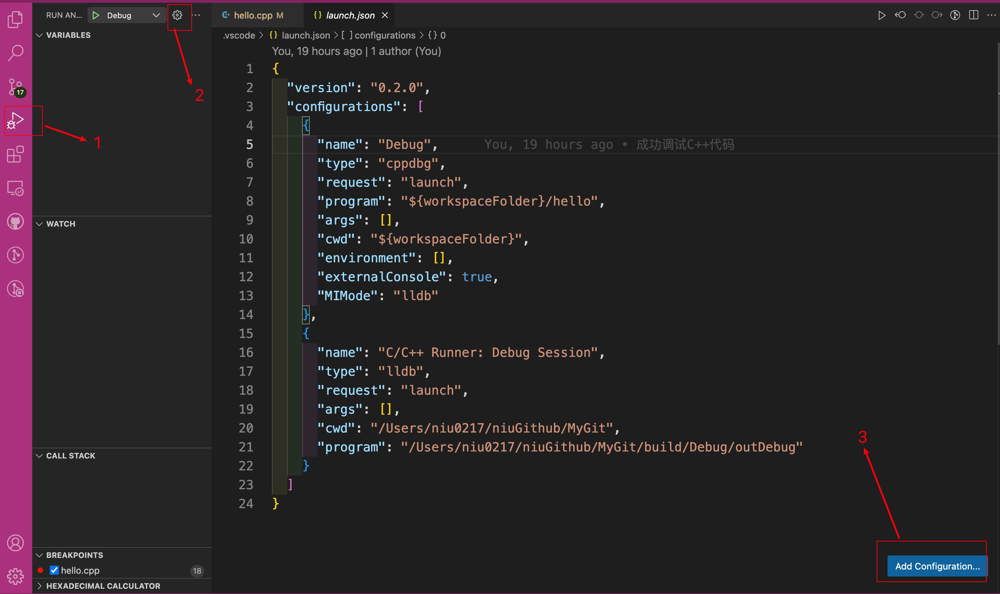
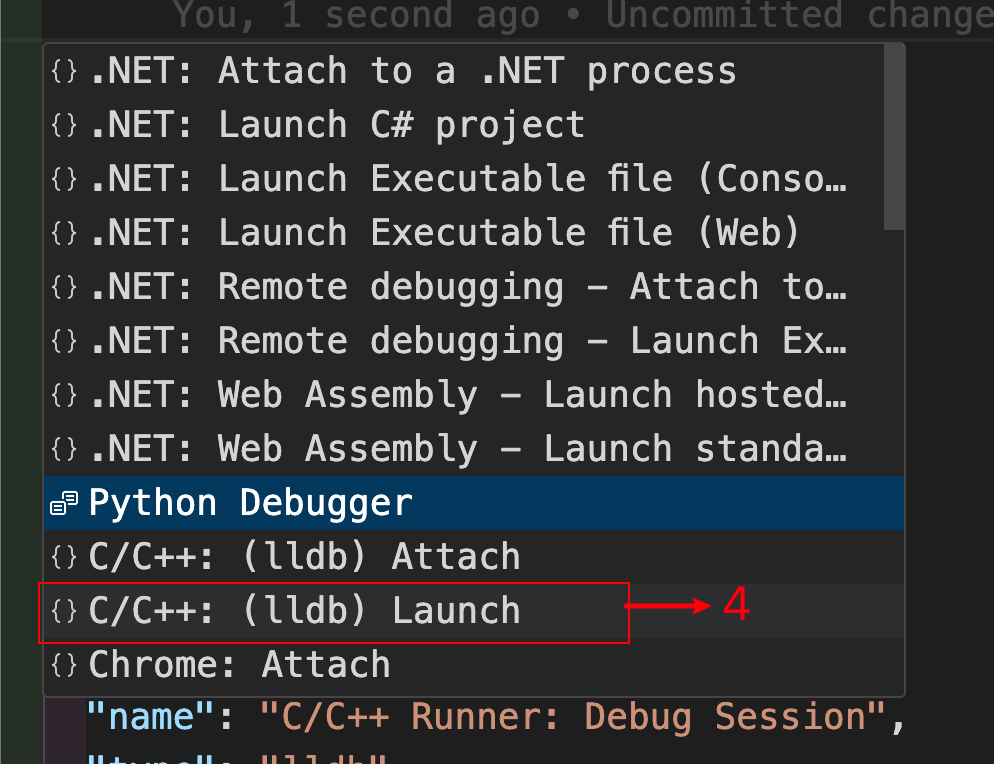
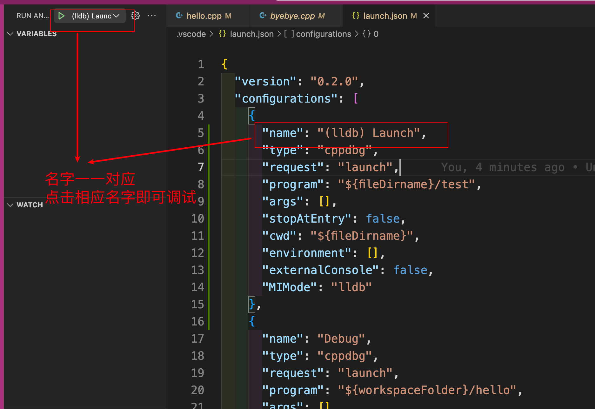

# 编译CPlusPlus代码2

## 1. 调试

### 1.1 创建tasks.json文件

我们需要创建一个tasks.json文件来告诉Visual Studio Code如何构建C++程序。

 

 

```json
{
	"version": "2.0.0",
	"tasks": [	
		{
			"type": "cppbuild",
			"label": "C/C++: g++ build active file",
			"command": "/usr/bin/g++",
			"args": [
				"-fdiagnostics-color=always",
				"-g",
				"${file}",
				"-o",
				"${fileDirname}/${fileBasenameNoExtension}"
			],
			"options": {
				"cwd": "${fileDirname}"
			},
			"problemMatcher": [
				"$gcc"
			],
			"group": {
				"kind": "build",
				"isDefault": true
			},
			"detail": "compiler: /usr/bin/g++"
		}
	]
}
```

+ command：定义了编译器的路径；
+ args：定义了传递给C++编译器的参数；

### 1.2 构建C++文件

按下`command + shift + B`就可以构建出可执行文件了。接下来就可以在终端执行可执行文件。

### 1.3 定制化tasks.json文件

+ 编译多个C++文件：

```json
{
	"version": "2.0.0",
	"tasks": [
		{
			"type": "cppbuild",
			"label": "C/C++: g++ build active file",
			"command": "/usr/bin/g++",
			"args": [
				"-fdiagnostics-color=always",
				"-g",
				"${workspaceFolder}/*.cpp",
				"-o",
				"${fileDirname}/${fileBasenameNoExtension}"
			],
			"options": {
				"cwd": "${fileDirname}"
			},
			"problemMatcher": [
				"$gcc"
			],
			"group": {
				"kind": "build",
				"isDefault": true
			},
			"detail": "compiler: /usr/bin/g++"
		}
	]
}
```

`${workspaceFolder}/*.cpp`：表示构建当前工作区中的所有C++文件；

+ 修改编译输出的文件名字：

```json
{
	"version": "2.0.0",
	"tasks": [
		{
			"type": "cppbuild",
			"label": "C/C++: g++ build active file",
			"command": "/usr/bin/g++",
			"args": [
				"-fdiagnostics-color=always",
				"-g",
				"${workspaceFolder}/*.cpp",
				"-o",
				"${fileDirname}/test"
			],
			"options": {
				"cwd": "${fileDirname}"
			},
			"problemMatcher": [
				"$gcc"
			],
			"group": {
				"kind": "build",
				"isDefault": true
			},
			"detail": "compiler: /usr/bin/g++"
		}
	]
}
```

`${fileDirname}/test`：可执行文件名字修改为test。

### 1.4 创建launch.json文件

launch.json文件是一个调试配置文件。

 

 

```json
{
  "version": "0.2.0",
  "configurations": [
    {
      "name": "(lldb) Launch",
      "type": "cppdbg",
      "request": "launch",
      "program": "${fileDirname}/test",
      "args": [],
      "stopAtEntry": false,
      "cwd": "${fileDirname}",
      "environment": [],
      "externalConsole": false,
      "MIMode": "lldb"
    },
    {
      "name": "Debug",
      "type": "cppdbg",
      "request": "launch",
      "program": "${workspaceFolder}/hello",
      "args": [],
      "cwd": "${workspaceFolder}",
      "environment": [],
      "externalConsole": true,
      "MIMode": "lldb"
    },
    {
      "name": "C/C++ Runner: Debug Session",
      "type": "lldb",
      "request": "launch",
      "args": [],
      "cwd": "/Users/niu0217/niuGithub/MyGit",
      "program": "/Users/niu0217/niuGithub/MyGit/build/Debug/outDebug"
    }
  ]
}
```

其中：

```json
{
  "name": "(lldb) Launch",
  "type": "cppdbg",
  "request": "launch",
  "program": "${fileDirname}/test",
  "args": [],
  "stopAtEntry": false,
  "cwd": "${fileDirname}",
  "environment": [],
  "externalConsole": false,
  "MIMode": "lldb"
},
```

这一段是新加的。

+ program是我们要调试的可执行文件的名字；
+ externalConsole表示是否要使用外部终端辅助调试；

 

## 2. 设置

相比于其他插件都是把设置项存储于Visual Studio Code的settings.json文件中，C/C++插件是通过c_cpp_properties.json文件来配置编译器、头文件路径、C++标准（默认是C++17）等设置项的。

